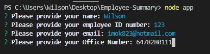
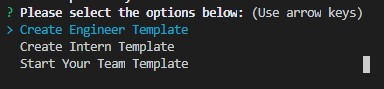

  
# Employee Generator

## Description:
    The application will prompt user's information about team manager and team members.  Generator a templates with all the information on team.html

## Table of Contents

- [Description](#description)
- [Installation](#installation)
- [Usage](#usage) 
- [Contributing](#contributing)
- [Test](#test)
- [License](#license) 
- [Questions](#questions)

## Installation:
    To use this application, first you will need to clone or download the codes from my GitHub and then run your terminal on the app.

## Usage:
    Step 1: Create a template for Manager. Step 2: Create a mix of engineers and interns. Step 3: Select "Start Your Team Template" to generator your team and end the program.

## License:
   - [MIT](https://choosealicense.com/licenses/mit/)
   - [ISC](https://choosealicense.com/licenses/isc/)

## Contributing:
    This is my own

## Test:
    Run the command : npm run test

## Questions: 
  - Please feel free to contact for additional questions by email below: 
  - [Email] wilsonruan23@gmail.com..
  - You may visit my GitHub Page for additional information below: 
  - [GitHub] https://github.com/Wilsonruan.
  